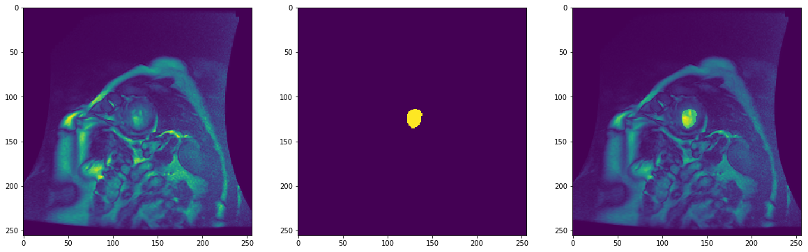

# Challenge DICOM MRI

### Part 1: Parse the DICOM images and Contour Files

- How did you verify that you are parsing the contours correctly?

First I visualize several pairs of pixel_data and mask and make sure that image 
have some meaningful structure in area corresponding to binary mask.

Then I create tests for functions parse_contour_file and poly_to_mask

- What changes did you make to the code, if any, in order to integrate it into our production code base? 

I changed parsing.py to use pydicom module instead of dicom. Also I changed poly_to_mask function to 
handle empty countour sequence.


### Part 2: Model training pipeline
- Did you change anything from the pipelines built in Parts 1 to better streamline the pipeline built in Part 2?
     If so, what? If not, is there anything that you can imagine changing in the future?

Yes, I added SkipSampleError exception in case there is error loading some sample. In this case we skip this sample.
- How do you/did you verify that the pipeline was working correctly?
First I checked that DataLoader returns batches of required sizes. Then I created test to check 
that loaded in batches data correspondes to data in Dataset (if shuffle is turned off).
- Given the pipeline you have built, can you see any deficiencies that you would change if you had more time? 
    If not, can you think of any improvements/enhancements to the pipeline that you could build in?

I didn't specify transform function, but if data can contain images of different sizes, we have to
specify function performing scalings of images and contours.
Ideally this pipeline should support multiprocessing, especially if we want to include some 
complex data augmentation.


Below you can find listing of jupyter notebook run.

```python
from dataset import DICOMDataset
from dataloader import DataLoader
```

Create dataset


```python
data_path = 'data/final_data'
data = DICOMDataset(data_path)
print('Dataset contains %d items' % len(data))
```

    Dataset contains 96 items


Load and visualize one of the data samples


```python
sample = data[95]
print('Image shape:', sample['pixel_data'].shape)
print('Mask shape:', sample['mask'].shape)
plt.rcParams['figure.figsize'] = [20, 20]
plt.subplot(131)
plt.imshow(sample['pixel_data'])
plt.subplot(132)
plt.imshow(sample['mask'])
plt.subplot(133)
plt.imshow(sample['pixel_data']*np.invert(sample['mask']) + (sample['pixel_data'] + 300)*sample['mask'])
```

    Image shape: (256, 256)
    Mask shape: (256, 256)





Create dataloader


```python
loader = DataLoader(data, batch_size=9, shuffle=True)
```


```python
for batch in loader:
    print(batch['pixel_data'].shape, batch['mask'].shape)
```

    (9, 256, 256) (9, 256, 256)
    (9, 256, 256) (9, 256, 256)
    (9, 256, 256) (9, 256, 256)
    (9, 256, 256) (9, 256, 256)
    (9, 256, 256) (9, 256, 256)
    (9, 256, 256) (9, 256, 256)
    (9, 256, 256) (9, 256, 256)
    (9, 256, 256) (9, 256, 256)
    (9, 256, 256) (9, 256, 256)
    (9, 256, 256) (9, 256, 256)
    (6, 256, 256) (6, 256, 256)

