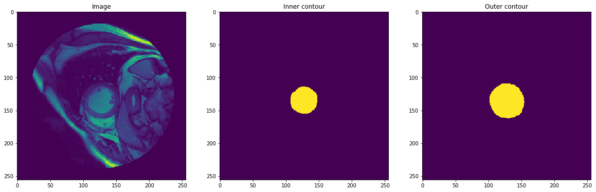
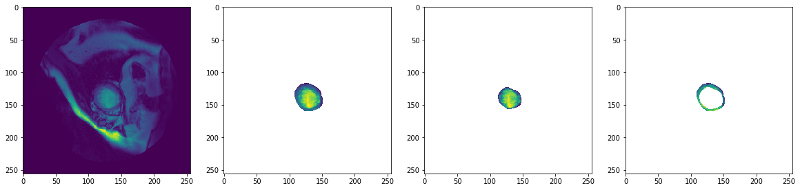
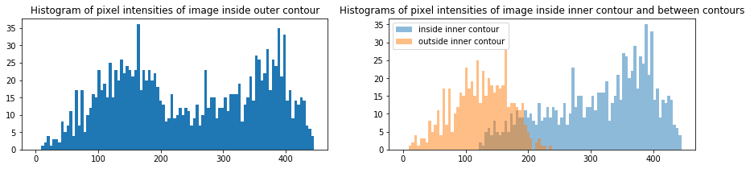
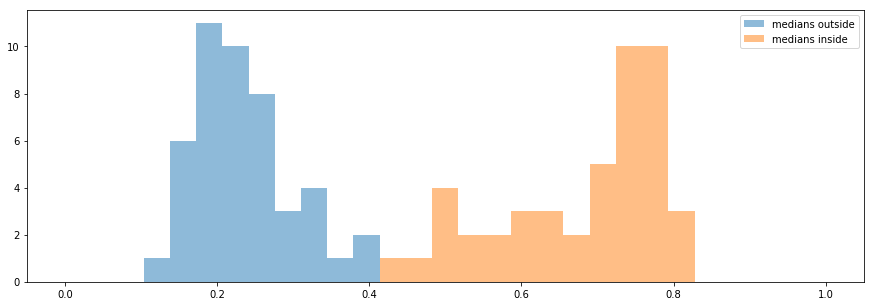
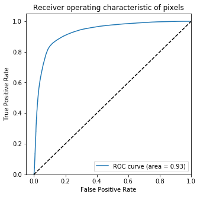
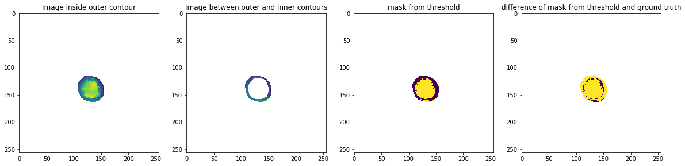

# Challenge DICOM MRI

## Phase 1

### Part 1: Parse the DICOM images and Contour Files

- How did you verify that you are parsing the contours correctly?

First I visualize several pairs of pixel_data and mask and make sure that image 
have some meaningful structure in area corresponding to binary mask.

Then I create tests for functions parse_contour_file and poly_to_mask

- What changes did you make to the code, if any, in order to integrate it into our production code base? 

I changed parsing.py to use pydicom module instead of dicom. Also I changed poly_to_mask function to 
handle empty countour sequence.


### Part 2: Model training pipeline
- Did you change anything from the pipelines built in Parts 1 to better streamline the pipeline built in Part 2?
     If so, what? If not, is there anything that you can imagine changing in the future?

Yes, I added SkipSampleError exception in case there is error loading some sample. In this case we skip this sample.
- How do you/did you verify that the pipeline was working correctly?

First I checked that DataLoader returns batches of required sizes. Then I created test to check 
that loaded in batches data correspondes to data in Dataset (if shuffle is turned off).
- Given the pipeline you have built, can you see any deficiencies that you would change if you had more time? 
    If not, can you think of any improvements/enhancements to the pipeline that you could build in?

I didn't specify transform function, but if data can contain images of different sizes, we have to
specify function performing scalings of images and contours.
Ideally this pipeline should support multiprocessing, especially if we want to include some 
complex data augmentation.


Below you can find listing of jupyter notebook run.

```python
from dataset import DICOMDataset
from dataloader import DataLoader
```

Create dataset


```python
data_path = 'data/final_data'
data = DICOMDataset(data_path)
print('Dataset contains %d items' % len(data))
```

    Dataset contains 96 items


Load and visualize one of the data samples

```python
sample = data[1]
print('Image shape:', sample['pixel_data'].shape)
print('Mask shape:', sample['imask'].shape)
plt.rcParams['figure.figsize'] = [20, 20]
plt.subplot(131)
plt.title('Image')
plt.imshow(sample['pixel_data'])
plt.subplot(132)
plt.imshow(sample['imask'])
plt.title('Inner contour')
plt.subplot(133)
plt.imshow(sample['omask'])
plt.title('Outer contour')
plt.show()
```

    Image shape: (256, 256)
    Mask shape: (256, 256)





Create dataloader


```python
loader = DataLoader(data, batch_size=9, shuffle=True)
```


```python
for batch in loader:
    print(batch['pixel_data'].shape, batch['imask'].shape, batch['omask'].shape)
```

    (9, 256, 256) (9, 256, 256) (9, 256, 256)
    (9, 256, 256) (9, 256, 256) (9, 256, 256)
    (9, 256, 256) (9, 256, 256) (9, 256, 256)
    (9, 256, 256) (9, 256, 256) (9, 256, 256)
    (9, 256, 256) (9, 256, 256) (9, 256, 256)
    (1, 256, 256) (1, 256, 256) (1, 256, 256)

## Phase 2

### Part 1: Parse the o-contours

To add parsing of o-contours I changed DICOMDataset class to support one more field. I have to replace field 'mask' of 
sample to two fields 'imask' and 'omask'. Also I changed test for dataset in accordance to these changes. There were no
need to change dataloader.

### Part 2: Heuristic LV Segmentation approaches

- Let’s assume that you want to create a system to outline the boundary of the blood pool (i-contours), 
and you already know the outer border of the heart muscle (o-contours). 
Compare the differences in pixel intensities inside the blood pool (inside the i-contour) 
to those inside the heart muscle (between the i-contours and o-contours); 
could you use a simple thresholding scheme to automatically create the i-contours, given the o-contours? 
Why or why not? Show figures that help justify your answer.


Below you can find listing of jupyter notebook that explores this thresholding approach.
```python
def masked_images(img, omask, imask, normalize=False):
    oimg = np.ma.MaskedArray(img, ~omask, dtype=np.float32)
    iimg = np.ma.MaskedArray(img, ~imask, dtype=np.float32)
    diffimg = np.ma.MaskedArray(img, ~np.logical_xor(imask, omask), dtype=np.float32)
    if normalize:
        maxval = oimg.max()
        minval = oimg.min()
        oimg = (oimg - minval)/(maxval - minval)
        iimg = (iimg - minval)/(maxval - minval)
        diffimg = (diffimg - minval)/(maxval - minval)
        
    return oimg, iimg, diffimg

```


```python
sample = data[5]
oimg, iimg, diffimg = masked_images(sample['pixel_data'], sample['omask'], sample['imask'])

plt.rcParams['figure.figsize'] = [20, 20]
plt.subplot(141)
plt.imshow(sample['pixel_data'])
plt.subplot(142)
plt.imshow(oimg)
plt.subplot(143)
plt.imshow(iimg)
plt.subplot(144)
plt.imshow(diffimg)
plt.show()
```





To decide if it posiible to use threshold to differentiate between pixels inside the blood pool (inside the i-contour) and pixels inside the heart muscle (between the i-contours and o-contours), lets first plot histogram of pixel intensities for some image.


```python
plt.rcParams['figure.figsize'] = [15, 3]
maxval = oimg.max()
plt.subplot(121)
plt.hist(oimg[oimg.mask == False], bins=np.linspace(0, maxval, 100))
plt.title('Histogram of pixel intensities of image inside outer contour')
plt.subplot(122)
plt.hist(iimg[iimg.mask == False], bins=np.linspace(0, maxval, 100), alpha=0.5, label='inside inner contour')
plt.hist(diffimg[diffimg.mask == False], bins=np.linspace(0, maxval, 100), alpha=0.5, label='outside inner contour')
plt.title('Histograms of pixel intensities of image inside inner contour and between contours')
pyplot.legend(loc='upper left')
plt.show()
```





We can see that pixel intensities inside and outside inner contour are from different distributions. Now lets normalize pixel intensities inside outer contour for each image so that each pixel value belongs to interval [0, 1]. Now we can compute median values of pixel intensities inside and outside inner contour for each image.


```python
loader = DataLoader(data, batch_size=1, shuffle=True)
medivals = []
medovals = []
for batch in loader:
    img = batch['pixel_data'][0]
    imask = batch['imask'][0]
    omask = batch['omask'][0]
    oimg, iimg, diffimg = masked_images(img, omask=omask, imask=imask, normalize=True)
    
    medivals.append(np.ma.median(iimg))
    medovals.append(np.ma.median(diffimg))
plt.rcParams['figure.figsize'] = [15, 5]
plt.hist(medovals, bins=np.linspace(0, 1, 30), alpha=0.5, label='medians outside')
plt.hist(medivals, bins=np.linspace(0, 1, 30), alpha=0.5, label='medians inside')
pyplot.legend(loc='upper right')
plt.show()
```





From this histogram we can see that median values of intensities inside inner contour are clearly different from median values of intensities outside inner contour. That means that simple threshold for creating inner contour will work.

We can now plot ROC curve for classification of pixels inside outer contour of all images with different thresholds for intensisties. As we can see, area under curve value is much bigger than 0.5


```python
from sklearn.metrics import roc_curve, auc
loader = DataLoader(data, batch_size=1, shuffle=True)
ground_truth_list = []
scores_list = []
fig, ax = plt.subplots(1,1)
for batch in loader:
    img = batch['pixel_data'][0]
    imask = batch['imask'][0]
    omask = batch['omask'][0]
    oimg, iimg, diffimg = masked_images(img, omask=omask, imask=imask, normalize=True)
    ground_truth = np.ma.MaskedArray(imask, ~omask)
    ground_truth_list.append(ground_truth[ground_truth.mask == False])
    scores_list.append(oimg[oimg.mask == False])

ground_truth = np.concatenate(ground_truth_list)
scores = np.concatenate(scores_list)
fpr, tpr, _ = roc_curve(ground_truth, scores)
roc_auc = auc(fpr,tpr)
plt.rcParams['figure.figsize'] = [5, 5]
ax.plot(fpr, tpr, label='ROC curve (area = %0.2f)' % roc_auc)
ax.plot([0, 1], [0, 1], 'k--')
ax.set_xlim([-0.05, 1.0])
ax.set_ylim([0.0, 1.05])
ax.set_xlabel('False Positive Rate')
ax.set_ylabel('True Positive Rate')
ax.set_title('Receiver operating characteristic of pixels')
ax.legend(loc="lower right")
plt.show()
```





We can also show mask generater with some threshold for one of the images.


```python
sample = data[6]
threshold = 0.45
oimg, iimg, diffimg = masked_images(sample['pixel_data'], sample['omask'], sample['imask'], normalize=True)
plt.rcParams['figure.figsize'] = [20, 5]
plt.subplot(141)
plt.title('Image inside outer contour')
plt.imshow(oimg)
plt.subplot(142)
plt.title('Image between outer and inner contours')
plt.imshow(diffimg)
plt.subplot(143)
plt.imshow(oimg > threshold)
plt.title('mask from threshold')
plt.subplot(144)
plt.imshow((oimg > threshold) == sample['imask'])
plt.title('difference of mask from threshold and ground truth')
plt.show()
```





#### Results 
We found out that simle thresholding approach can give us pretty good results. But there are some drawbacks such as 
artefacts on the segmentation border and some noise that can be fixed with mask image postprocessing with
  morphological operations.

- Do you think that any other heuristic (non-machine learning)-based approaches,
 besides simple thresholding, would work in this case? Explain.

 I think that postprocessing of binary mask, such as removing small disconnected segments,
  morphological operations for image closing or perhaps computation of convex closure of the
  inner contour mask would improve simple thresholding approach a lot.
  Also it may be possible to use some edge detector to try to improve exact location of segmentation
  bounbary, combining it with threshold detector.
  